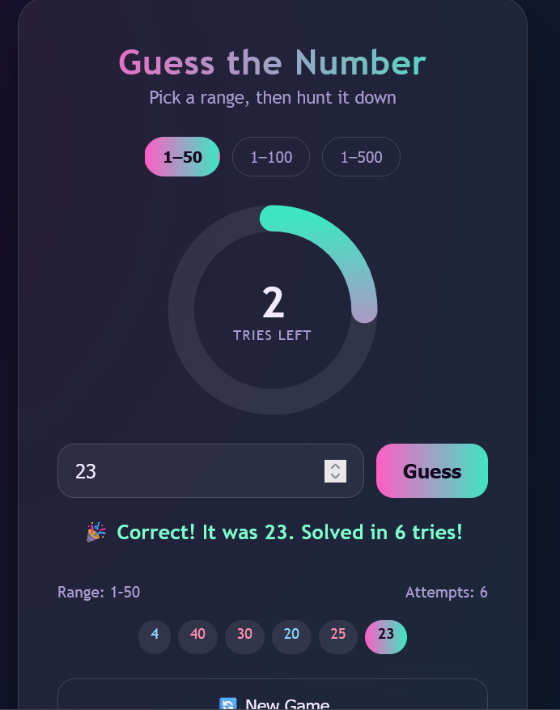

# Number Guess Game

A simple web-based Number Guess Game built using HTML, CSS, and JavaScript.

## Features
- Random number 
- Hint messages 
- Tracks user attempts
- Restart game option

## Technologies Used
- HTML  # for structure 
- CSS   # for designing
- JavaScript # for interactivity

## How to Play
1. Enter a number.
2. Click the **Guess** button.
3. Receive hints until you guess the correct number.
4. Restart and play again.

# Screenshots

## Author
Deepsikha Singh